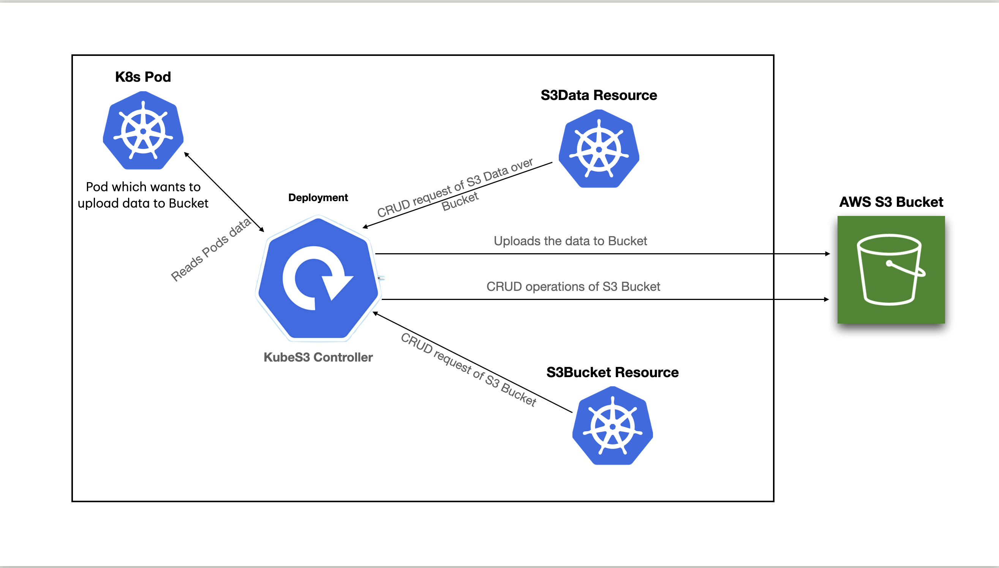

# kubeS3
This project lets you create and manage S3 buckets in AWS using Kubernetes CRDs.
This can upload your pod's data to your desired S3 bucket.
This is build with tht help of [Kubebuilder](https://book.kubebuilder.io/) tool.

## Description
kubeS3 is a Kubernetes controller that allows you to create and manage S3 buckets in AWS using Kubernetes CRDs. It provides a simple way to create and manage S3 buckets in AWS using Kubernetes CRDs.

## Possible Use Cases
- We can use this to back up logs from the pods to S3.
- We can use this to store any other sensitive data from the pods to S3.

## Features
You can automate the management of S3 buckets in AWS using Kubernetes CRDs. The following are the features of kubeS3:

## Getting Started
To get started with kubeS3, you need to have the following prerequisites installed on your system:

## Diagram

     

### Prerequisites
- go version v1.22.0+
- docker version 17.03+.
- kubectl version v1.11.3+.
- Access to a Kubernetes v1.11.3+ cluster.
- Local cluster setup using kind or minikube.
- Access to an AWS account and the aws keys injected on your environment.

TODO Add a arch diagram here